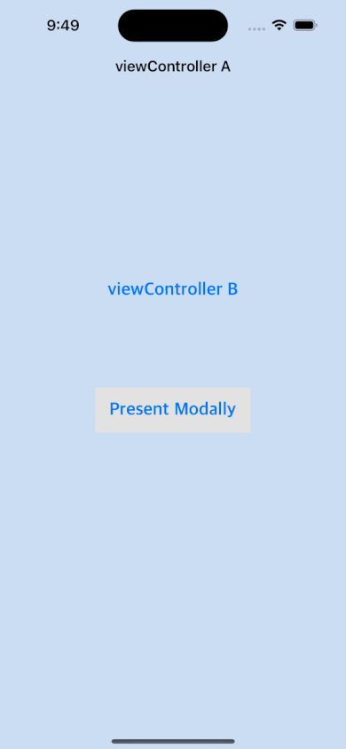

# UINavigationController

- 계층적 콘텐츠를 탐색하기 위한 스택 기반 도식화를 정의하는 컨테이너 뷰 컨트롤러이다. 
- NavigationController 는 내비게이션 인터페이스에서 하나 이상 자식 뷰 컨트롤러를 관리하는 컨테이너 뷰컨트롤러다. 
 

 

>  **NOTE**
> 
>  iOS 7이상에서는 ContentView 가 탐색 모음 아래 위치함으로 뷰 컨트롤러 컨텐츠를 디자인할때는 해당 공간을 고려해줘야함.

- navigation Bar에 대해 커스텀해주고 싶다면 [`UIAppearance`](https://developer.apple.com/documentation/uikit/uiappearance) API를 사용해야한다.
  

### **Adapting to different enviroment - 다른 화면 뷰 전환**
수평적으로 컴팩트한 환경에서 수평으로 일반 환경 모두에 동일하게 유지되고, 
두 환경사이를 전환할 때 NavigationController 의 View 크기만 변경된다. NavigationController 는 뷰 계층구조나 뷰 레이아웃을 변경하지 않는다. 

###  **-> Navigation 스택의 뷰컨트롤러 간에 segue를 구성할 때 standard Show 와 show Detail segues 는 아래와 같이 동작한다.**

- `Show segue`
  
  NavigationController 는 특정 뷰 컨트롤러를 push 한다. 
- `Show detail segue`
  
   navigation controller 는 지정된 뷰 컨트롤러를 모달 방식으로 표시한다. 
   (위에서 아래로 쑤욱 올라오는 형태)

## **Pushing and Popping stack item**
`pushViewController`

뷰 컨트롤러를 받는 뷰의 스택에 푸시하고 display를 업데이트한다.

`popViewController`

내비게이션 스택에서 최상위 보기 컨트롤러를 팝하고 디스플레이 업데이트 
(그 바로 전 뷰로 이동 (Back)을 생각하면 쉽다.)

`popToRootViewController`

루트 뷰 컨트롤러를 제외한 스택의 모든 뷰 컨트롤러를 pop(뱉어내서 반환하는 개념)하고 디스플레이를 업데이트한다. 루트 뷰로 이동한다는 것

`popToViewController`

지정된(원하는) 뷰 컨트롤러가 내비게이션 스택의 맨 위에 올 때까지 뷰 컨트롤러를 Pop (꺼낸다)한다. 

 

### **각각의 화면 전환 방법** 

- 첫번째 뷰는 show Push 다음 뷰
- 두번째 뷰(viewController B) 에서 viewController C 이동도 show push 
- 두번째 뷰에서 present modally 효과
- 세번째 뷰 viewController C 에서
  - Back 버튼은 -> 바로 전 뷰 `popViewController`
  - To RootViewController 버튼 처음 화면 `popToRootViewController`
  - 특정 뷰로 이동 `popToViewController`
  - 스토리보드의 identity의 storyboard ID String 값 지정 
     `storyboard?.instatiateViewController(identifier:"String")`    